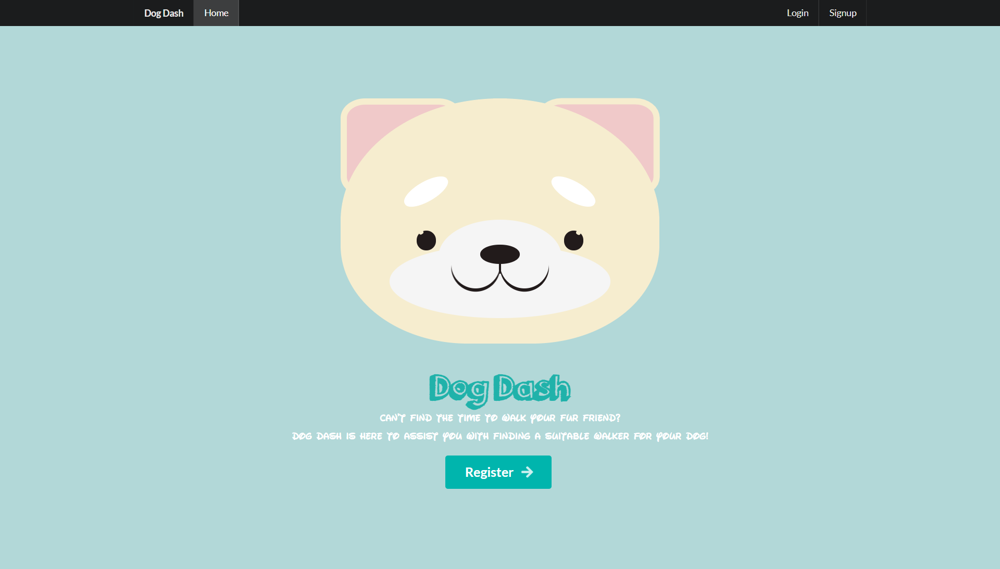

# <a href="https://dog-dash.herokuapp.com/">🐶 Welcome to Dog Dash! 🐶</a>

## 🐕 Table of Contents 🐕

* [Licenses](#Licenses) 
* [Overview](#Overview)
* [Features](#Features)
* [Technologies](#Technologies)
* [Functionality](#Functionality)
* [Presentation](#Presentation)
* [Status](#Status)
* [Texting](#Texting)
* [Contributors](#Contributors)
* [Questions](#Questions)
* [Credits](#Credits)
* [Webpage](#Webpage)

## 📜 License 📜 

  

## 🐾 Overview 🐾
Welcome to Dog Dash! This is a web application for seeking dog walker. Even though more and more people are working from home and have potentially more time to take care of their dogs, the reality is that some people have a job function that does not allow them to go outside for a dog walk. Even when the dog owner has time, he may want to spend it on other activities than walking the dog. Elderly people could also need help walking their dog especially during cold weather.

## 🐾 Features 🐾
This webpage is benefit for both dog owners and dog walkers. As a dog owner, the user can find a walker for his/her dog so that the user will have free time for other activities. As a dog walker, the user can find a job, so that he/she can earn money.
Main functionalities:
1. When user opens the website, then user sees a login/signup section.
2. When user is logged in on the website, then user sees job postings and a list of dog walkers. The user can also see ratings, comments, MyJob section. If the user is a dog owner, user can see a cart section. If user is a dog walker, user can click to apply to a job and it will be added to MyJobs page, Dog walker can click on a user to see more details.
3. When user views other users profile, then user can see the user details, the individual ratings and add comments.
4. When user clicks on the picture, then user can see the detail of the dog information. 
5. When user is a dog owner and clicks on MyJobs, then user can see and create the jobs (live and done). User can also see the job applicants and select a dog Walker if it is not already done. If user selects a dog Walker, that item is added to the cart. The owner can go to cart and make the payment checkout.
6. When user is a dog walker and clicks on MyJobs, then user can see the jobs he/she applied for (live and done). User can withdraw my application as long as user is not selected yet.
10. When user logout, then user is directed back to the register page.

## 🐾 Technologies 🐾

### Front-end 
* <a href="https://www.apollographql.com/docs/react/api/react/hooks/">Apollo/React-Hooks</a>
* <a href="https://www.npmjs.com/package/apollo-boost">Apollo-Boost</a>
* <a href="https://graphql.org/">Graphql</a>
* <a href="hhttps://reactjs.org/">React</a>
* <a href="https://www.npmjs.com/package/jwt-decode">JWT-Decode</a>
* <a href="https://www.npmjs.com/package/react-scripts">React-Scripts</a>
* <a href="https://semantic-ui.com/">Semantic-UI</a>
* <a href="https://aws.amazon.com/s3/">AWS S3</a>

### Back-end
* <a href="https://www.npmjs.com/package/apollo-server-express">Apollo-Server-Express</a>
* <a href="https://www.npmjs.com/package/bcrypt">Bcrypt</a>
* <a href="https://expressjs.com/">Express.js</a>
* <a href="https://www.npmjs.com/package/jsonwebtoken">JsonWebToken</a>
* <a href="https://mongoosejs.com/">Mongoose</a>
* <a href="https://stripe.com/docs/payments/accept-a-payment?ui=checkout">Stripe</a>

 
## 🐾 Functionality 🐾

## 🐾 Status 🐾

## 🐾 Presentation 🐾
[Dog Dash.pptx](./client/src/assets/dogdash.pptx)

## 🐾 Texting 🐾

## 🐾‍ Questions / Contributions 🐾‍
Any questions or contributions can be sent to our group email at pro3gro3@gmail.com!

## 🐾 Contributors 🐾

|Curtis Smith|Fazle Ryan Chowdhury|Johann Taylor|Malek Ben Jemia|Manjula Guneratne
|:---:|:---:|:---:|:---:|:---:|
||||||
|<a href="https://github.com/cjsmith1988">Curtis's Github</a>| <a href="https://github.com/ryan7998">Fazle's Github</a>|<a href="https://github.com/johannt91">Johann's Github</a>|<a href="https://github.com/malek-benjemia">Malek's Github</a>|<a href="https://github.com/Manjula85">Manjula's Github

|Neeko Tang|Rajendra Dhanraj|Richard Lim|Shanshan Tina Xu
|:---:|:---:|:---:|:---:|
|||||
|<a href="https://github.com/Neeko623" target="_blank">Neeko's Github</a>|<a href="https://github.com/Rajendra-Dhanraj" target="_blank"> Rajendra's Github</a>|<a href="https://github.com/Lim95" target="_blank"> Richard's Github</a>|<a href="https://github.com/shanshantina" target="_blank"> Shanshan(Tina)'s Github</a>|

## 🐾 Credits 🐾
A special thank you to our teachers, and to the technologies we used!

## 🐾 Webpage 🐾

### <a href= "https://dog-dash.herokuapp.com/"> Dog Dash Link
### <a href= "https://github.com/pro3gro3/walk-my-dog/"> Dog Dash Github Page
